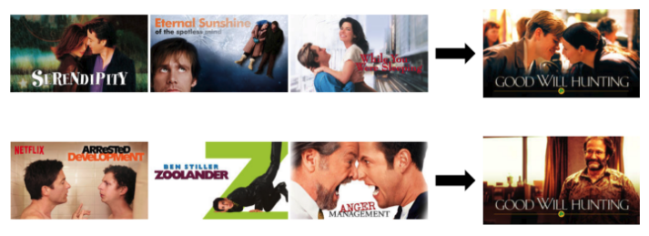

[본문 link](https://netflixtechblog.com/artwork-personalization-c589f074ad76)

몇 년 동안 넷플릭스 개인화 추천 시스템의 주요 목표는 사용자들에게 적시에 적절한 타이틀을 제공하는 것이었다. 
하지만 해당 작업으로 추천이 끝나지 않는다. 

처음 보이는 아트웍은 타이틀로 들어갈 수 있는 시각적 증거를 제시한다. 
사용자가 알고 있는 배우를 보여주기도 하며, 자동차 추격신처럼 가슴 뛰는 장면을 포함할 수도 있고, 해당 TV show의 주요 장면을 포함할 수 있다.
이러한 정보가 적절하게 포함되어있다면 사용자는 해당 영상을 맛볼 수도 있다.

# Challenges
이전에는, 멀티 암 밴딧 알고리즘을 활용해서 모든 사용자에게 적합한 하나의 완벽한 아트웍을 찾고자 했다. 
그러나 다양한 취향과 선호를 바탕으로 각자에게 어울리는 아트웍을 보여주는 것이 더 좋지 않을까 하는 의문에 따라 개별적으로 적용하는 아트웍이 의미 있는지 탐구하는 시나리오를 세웠다.

기존에 사용자들이 보았던 타이틀과 아트웍을 바탕으로 적절한 아트웍을 보여준다.

로맨틱 TV show를 많이 본 사용자에게는 로맨틱한 아트웍을, 코미디 TV show를 많이 본 사용자에게는 유명 코미디언이 나오는 아트웍을 선정하는 방식을 활용해본다.

> Of course, not all the scenarios for personalizing artwork are this clear and obvious. So we don’t enumerate such hand-derived rules but instead rely on the data to tell us what signals to use. Overall, by personalizing artwork we help each title put its best foot forward for every member and thus improve our member experience.

넷플릭스에서는 다양한 곳에 개인화가 활용되고 있다.(어떤 row에 어떤 타이틀을 담고, 어떤 이미지를 보여주며, 어떤 메시지를 보낼 것인지 등)
각각의 요소에는 각각의 도전 과제들이 존재한다.

아트웍을 고르는 과정에서는 "단 하나의 이미지밖에 사용하지 못한다"는 문제가 있다. 또한 아트웍을 제공해서 시청이라는 결과가 이루어지는지 확인이 어렵다.
때로는 아트웍의 변경이 타이틀을 파악하기 어렵게 만들기도 한다. 지속적인 아트웍의 변경은 사람들에게 혼동을 주기도 한다. 
또한 같은 세션이나 페이지에 제공된 다른 아트웍들과의 관계로 인해 파악이 어려운 점이 존재한다. 
효과적인 개인화를 위해서는 좋은 아트웍들이 담긴 pool이 필요하다. 다양한 니즈를 해결할 수 있을 만큼 많은 아트웍이 준비되어 있어야 한다.
또한 규모에 따라 개인화의 엔지니어링 문제가 발생한다. 

# contextual bandit approach
새로운 모델을 개발해서 A/B test 이후 적용이 된다면, 
해당 기간 동안 대조군에 있는 유저들은 혜택을 받지 못했기 때문에, 
batch machine learning을 제외하고 online machine learning을 고려했다.

데이터를 수집하거나, 모델이 학습될 때까지 기다리기보다는 contextual bandit을 활용해 빠르게 유저 개인화된 아트웍을 고른다.
contextual bandit은 기존에 발생하던 혜택을 받지 못하는 구간을 줄이도록 디자인되었다.
Exploration에 대한 비용이 크지 않기 때문에 잘 활용될 수 있다.

# Model training
온라인 학습 환경에서 상황에 맞는 밴딧 모델을 훈련하여 상황에 따라 각 사용자에게 가장 적합한 아트웍을 선택한다. 
일반적으로 제목당 최대 수십 개의 후보 아트웍 이미지가 있고, 선택 모델을 배우기 위해 제목에 걸쳐 독립적으로 사용자에 대한 이미지 순위를 지정하여 문제를 단순화할 수 있다. 
이러한 단순화에도 불구하고 모든 이미지 후보에 대해 제목이 제공되고 참여하는 사용자와  참여하지 않은 사용자가 있기 때문에, 제목 전체에 걸쳐 사용자 이미지 선호도를 배울 수 있다. 
이러한 선호도는 각 (사용자, 직위, 이미지) 튜플에 대해 사용자가 양질의 참여를 즐길 확률을 예측하도록 모델링될 수 있다.
이는 데이터 탐색과 최상의 예측을 지능적으로 균형을 이루는 Thompson Sampling, LinUCB 또는 베이지안 방법을 사용하는 지도 학습 모델 또는 상황에 맞는 밴딧일 수 있다.

# potential signal
context bandit에서 context는 일반적으로 모델에 대한 입력으로 제공되는 특징 벡터로 표시된다.
타이틀, 타이틀의 장르, 특정 타이틀에 대한 사용자의 상호작용, 사용자의 국가, 사용자의 언어 선호도, 사용자가 사용하는 장치, 하루 중 시간과 요일등을 활용할 수 있다.
사용되는 이미지와 상관없이 제목에 대해 어떻게 생각하는지에 대한 신호를 사용할 수도 있다.

중요한 고려 사항은 일부 이미지가 후보 풀의 다른 이미지보다 자연적으로 더 좋다는 것이다.
우리는 데이터 탐색에서 모든 이미지에 대한 전체 반응 비율(재생 수/노출 수)을 관찰합니다.
개인화 모델에서 전반적인 반응 비율은 여전히 ​​중요하며 개인화는 여전히 개인화되지 않은 모델의 순위와 평균적으로 일치하는 선택을 복구한다.

이미지 아트웍를 최적으로 할당하는 것은 타이틀의 사용 가능한 이미지 풀에서 최적의 후보 이미지를 찾기 위한 선택 문제다.
확률에 따라 이미지의 후보 세트를 정렬하고 가장 높은 확률을 가진 이미지를 선택한다.

# 성능 평가
## offline
실제 사용자에게 온라인으로 배포하기 전에 평가하기 위해 _replay_라고 하는 오프라인 기술을 사용할 수 있다.
다시 말해서, 편견 없는 방식으로 다른 알고리즘을 사용했다면 다른 시나리오에서 과거 세션에서 일어났을 일을 오프라인에서 비교할 수 있다.

_replay_를 통해 프로덕션에서 사용되는 알고리즘이 아닌 새로운 알고리즘을 통해 선택된 이미지를 가상으로 제시했다면 사용자들이 우리 타이틀에 어떻게 참여했을지 알 수 있다.
이미지의 경우 위에서 설명한 것처럼 여러 메트릭, 특히 테이크 프랙션에 관심이 있한니다.

코미디는 코미디 타이틀을 주로 보는 프로필을 의미한다.
마찬가지로 Romance는 대부분 낭만적인 제목을 본다.
contextual bandit은 코미디 성향의 프로필을 위해 유명한 코미디언인 Robin Williams의 이미지를 선택하고 로맨스에 더 가까운 프로필을 위한 키스 커플의 이미지를 선택한다.

## Online
오프라인 테스트 이후 A/B test를 통해 회원이 제목과 사전 상호 작용이 없는 경우 개인화 개선이 더 컸음을 확인했다.
제목이 덜 친숙할 때는 아트웍이 누군가에게 더 중요할 것이라고 예상하기 때문에 이것은 의미가 있습니다.
